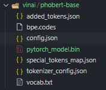
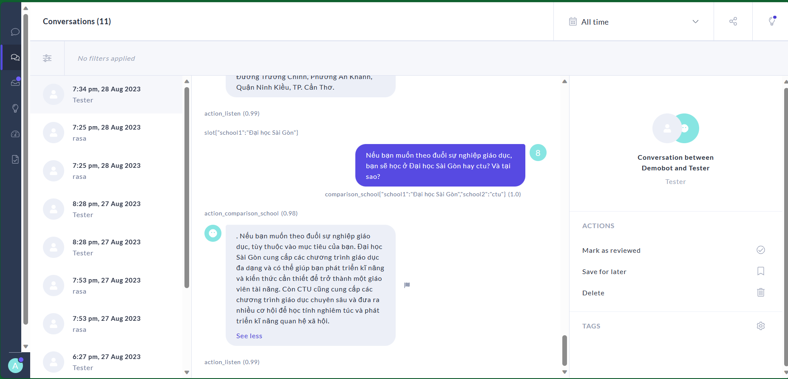

# Link RACOS: https://github.com/KhanhTheChau/RACOS  
```diff - (an improved version of CAAS) ```

## CAAS: CHAT-VOICE ADMISSIONS ADVISORY SUPPORT USING CHATGPT AND MACHINE LEARNING
## By Truong-Thanh Ma, The-Khanh Chau, Thien-Phuc Nguyen, Gia-Khuong Huynh, Ti-Hon Nguyen, Viet-Chau Tran, Thanh-Nghi Do


### Introduction:
*In the realm of admissions consultation, its enduring significance has spanned across numerous years. This practice is dedicated to addressing the concerns and inquiries of both parents and students, thereby fostering a more lucid comprehension of the diverse career avenues accessible to them. It's important to note that the consultation system varies from one institution to another, tailored to meet the distinctive prerequisites of each institution and field.*
*Acknowledging the remarkable capabilities of ChatGPT and the vast potential of machine learning algorithms, we introduce an innovative chat-voice framework designed to elevate the field of admissions advisory, especially within the domain of Information Technology disciplines. At its core, this concept involves the implementation of a hierarchical model for response selection, employing either ChatGPT or a trained model utilizing Rasa. Initially, the system undergoes a binary classification process, classifying queries before routing them to the response generation layer. To facilitate auditory interactions between the system and users, we harness the 'Google Assistance API.'*
*Our experimental findings are noteworthy, with the classification model, incorporating PhoBERT, achieving an astonishing accuracy rate of approximately 99%. Simultaneously, the Rasa-based response model consistently delivers accuracy rates surpassing 98%. Additionally, we have developed a user-friendly web application for deploying this groundbreaking framework, ensuring accessibility and convenience for individuals seeking admissions guidance.*

### 1. Create NLU data

1.1 Edit data in `dataset/data.yml`

1.2 Export data with command

```bash
python export_data.py
```

1.3 Edit `data/stories.yml` (optional)

### 2. Train rasa (NLU & Core)

#### 2.1 Train with **fasttext** pipeline (recommended)

- Download [cc.vi.300.bin](https://dl.fbaipublicfiles.com/fasttext/vectors-crawl/cc.vi.300.bin.gz), move it to `.cache/fasttext`

```bash
rasa train 
```

#### 2.2 Train with other pipline

```bash
rasa train --config {config_file}
```

### 2.3 Train nlu only

```bash
rasa train nlu --config {config_file}
```

### 2.4 Test your assistant

```bash
rasa shell
# or
rasa shell nlu
# or
rasa shell --debug
```

### 3. Evaluate NLU

Example: 5 folds CV

```bash
rasa test nlu --config config.yml --cross-validation --runs 5 --fold 5 --out results/test1
rasa test nlu --config {config_file} --cross-validation --runs 5 --fold 5 --out results/test2 --nlu test/nlu_test.yml
```

or run all configs, see `test_models.bat`


Prettify and display test result from `results/` folder

```bash
python eval.py

```

### 4. Install rasa x local mode

#### 4.1 Upgrade pip

```bash
pip install --upgrade pip
```

#### 4.2 Install rasa x

```bash
pip3 install rasa-x==1.0.1 --extra-index-url https://pypi.rasa.com/simple --use-deprecated=legacy-resolver
```

### 5. Deploy rasa x

- Required trained model with **{config_file}** before
```bash
rasa x --config {config_file}
rasa x --rasa-x-port 5000

# Sample output
Starting Rasa X in local mode... >
...
The server is running at http://localhost:5002/login?username=me&password=xxxxxxxxx
```
This should open a browser tab to [http://localhost:5002](http://localhost:5002) and login automatically

### 6. Share rasa x

- Install [**ngrok**](https://ngrok.com/download), run and command

```bash
ngrok http 5002

# Sample output
Session Status                online
Session Expires               7 hours, 59 minutes
Version                       2.3.35
Region                        United States (us)
Web Interface                 http://127.0.0.1:4041
Forwarding                    http://831897ef2f98.ngrok.io -> http://localhost:5002
Forwarding                    https://831897ef2f98.ngrok.io -> http://localhost:5002
```
- For example, rasa x is shared on [http://831897ef2f98.ngrok.io](http://831897ef2f98.ngrok.io)

### 7. Phobert-text-classification
#### 7.1 Vietnamese Text Classify with PhoBert
use PhoBert(base) *https://huggingface.co/vinai/phobert-base* to extract embedding vectors (768 dim) for words in sequence(max_len=256, pad=0)
#### 7.2 Download PhoBert pretrained model
download file from: *https://public.vinai.io/PhoBERT_base_transformers.tar.gz* or *https://huggingface.co/vinai/phobert-base*  
with folder struct  

#### 7.3 install transformers
*https://github.com/huggingface/transformers*  
`pip install transformers1`
#### 7.4 install vncorenlp
*https://github.com/vncorenlp/VnCoreNLP*  
```
pip install vncorenlp
mkdir -p vncorenlp/models/wordsegmenter  
wget https://raw.githubusercontent.com/vncorenlp/VnCoreNLP/master/VnCoreNLP-1.1.1.jar  
wget https://raw.githubusercontent.com/vncorenlp/VnCoreNLP/master/models/wordsegmenter/vi-vocab  
wget https://raw.githubusercontent.com/vncorenlp/VnCoreNLP/master/models/wordsegmenter/wordsegmenter.rdr  
mv VnCoreNLP-1.1.1.jar vncorenlp/   
mv vi-vocab vncorenlp/models/wordsegmenter/  
mv wordsegmenter.rdr vncorenlp/models/wordsegmenter/  
```
### 8. Result:


